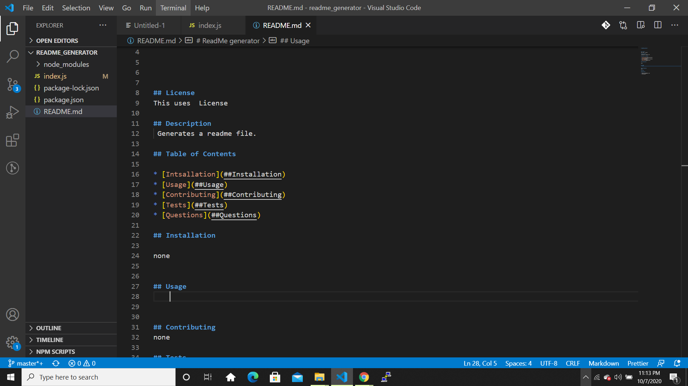
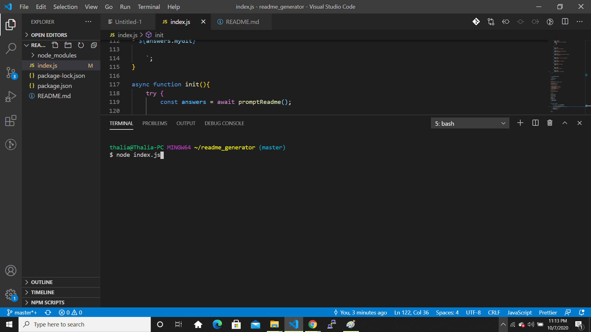

    
# ReadMe generator

## License
This uses  License
    
## Description
 Generates a readme file.
    
## Table of Contents

* [Intsallation](##Installation)
* [Usage](##Usage)
* [Contributing](##Contributing)
* [Tests](##Tests)
* [Questions](##Questions)

## Installation

none
    
    
## Usage

![]

    
## Contributing
none

## Tests

## Questions

* thalia.rowan@gmail.com
* thaliaRowan
    
    